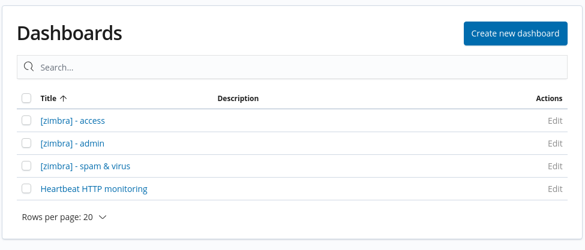
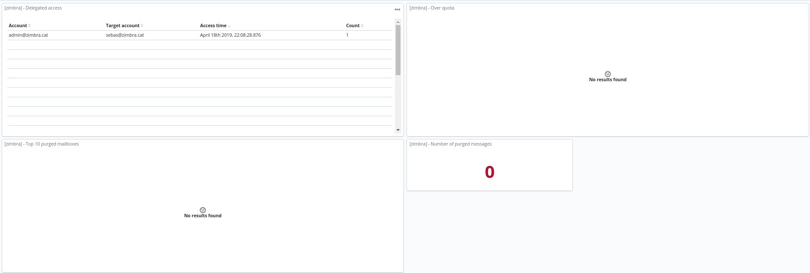
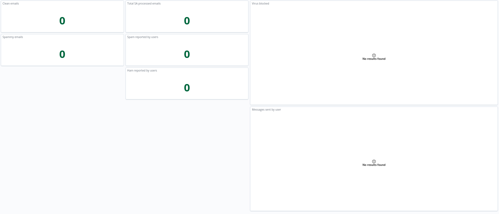
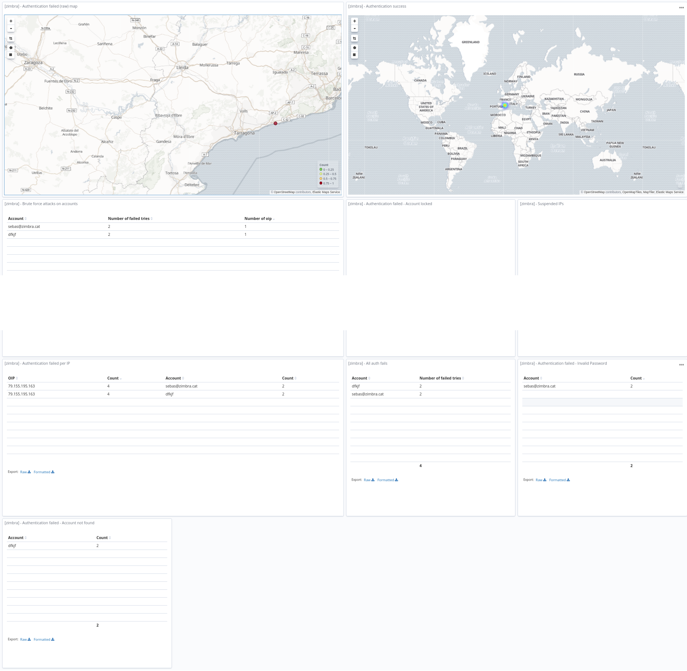
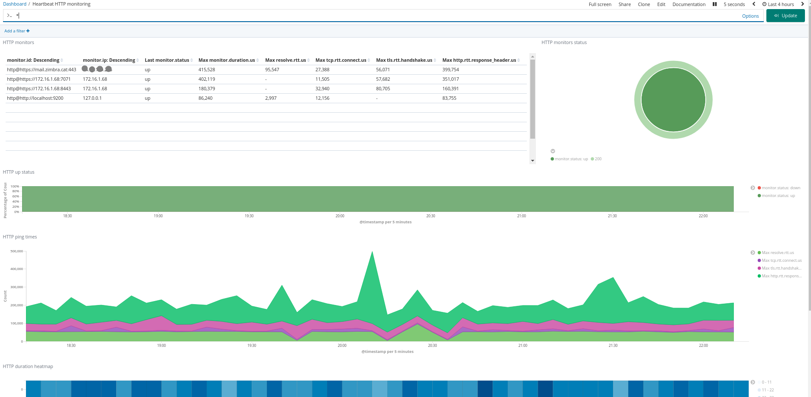
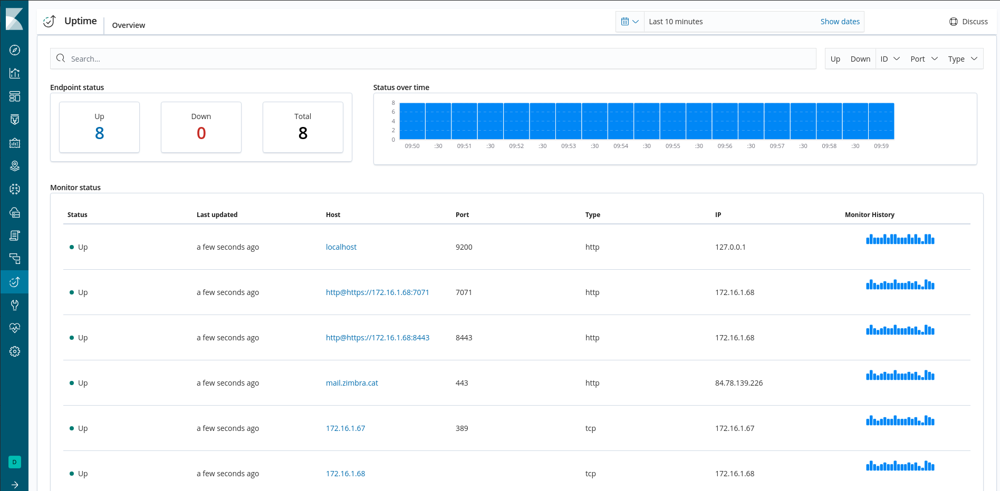

# zimbra-elasticstack
Elastic Stack configuration files for Zimbra logging, filtering and visualization in Kibana.

- filebeat_zimbra_store.yml - This configuration file needs to be adjusted with your logstash server IP or FQDN. And then copyied to
/etc/filebeat/ on the zimbra servers with the filebeat rpm installed.

- .json files under kibana folder are meant to be imported via Kibana UI. Exporting/Importing via CLI is not quite
there yet. https://www.elastic.co/guide/en/kibana/master/saved-objects-api.html

- Import of kibana .json files is now done at once AFTER creating the zimbra index template.

- 20_filter_zimbra.conf should be copied under /etc/logstash/conf.d folder. Basic input (beat) and output (elasticsearch) files are necessary.

- 30_output.conf shows the zimbra index naming convention that works with the customized zimbra index template.

- Zimbra index template is to be added via Kibana "dev tools" webUI.

Once you add this configurations to your Elastic Stack and configure your Zimbra servers to use it, you will be able to see this information in your Kibana.

<h3>List of dashboards</h3>

<h3>Admin dashboard</h3>

<h3>Spam and Virus dashboard</h3>

<h3>Auth dashboard</h3>

<h3>Hearbeat dashboard</h3>

<h3>Uptime (heartbeats monitors != http)</h3>

